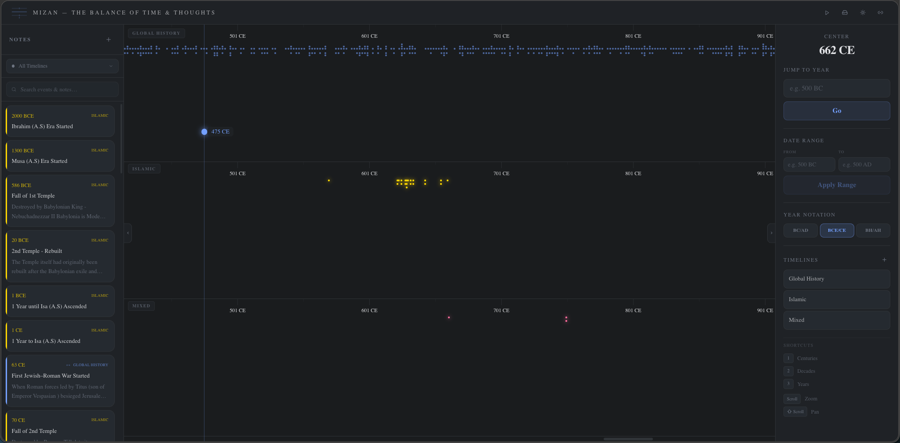

# Mizan

A high-performance, virtualized historical timeline spanning from 4001 BC to 2026 AD. Built with Next.js, Mizan renders thousands of years of history in a smooth, scrollable interface with multiple zoom levels.

<a href="https://mizan-tl.vercel.app">
  
</a>

## 📝 Features

Checkout live at: [https://mizan-tl.vercel.app](https://mizan-tl.vercel.app)

- **Infinite scroll** across 6,000+ years of history
- **Three zoom levels** — Centuries, Decades, and Years — for exploring at different scales
- **Virtualized rendering** — only visible elements are in the DOM, keeping performance snappy
- **Multiple timelines** — create and manage parallel timeline tracks
- **Notes** — click to add notes to any year
- **URL sync** — view state and deep links are reflected in the URL

## 🎨 Look'n Feel
### Date Ranges
Filter out dates you don't want to see.


### Interval Notes
Can link 2 notes together to create an interval.


### Multiple Timelines
Can manage up to 5 timelines at a time.


## 🛠 Tech Stack

- [Next.js 15](https://nextjs.org/) (App Router)
- [React 19](https://react.dev/)
- [Tailwind CSS v4](https://tailwindcss.com/)
- [Zustand 5](https://zustand.docs.pmnd.rs/) for state management
- [Framer Motion](https://motion.dev/) for animations
- [Lucide React](https://lucide.dev/) for icons

## 🚀 Getting Started

### Prerequisites

- Node.js 18+
- npm

### Installation

```bash
git clone https://github.com/mhmzdev/mizan.git
cd mizan
npm install
```

### Development

```bash
npm run dev
```

The app runs at [http://localhost:9999](http://localhost:9999).

### Production Build

```bash
npm run build
npm run start
```

## 📄 License

This project is licensed under the MIT License. See the [LICENSE](LICENSE) file for details.


## 🧑 Author

#### Muhammad Hamza
[](https://www.linkedin.com/in/mhmzdev)

You can also follow my GitHub Profile to stay updated about my latest projects:

[](https://github.com/mhmzdev)

If you liked the repo then kindly support it by giving it a star ⭐!

Copyright (c) 2026 MUHAMMAD HAMZA